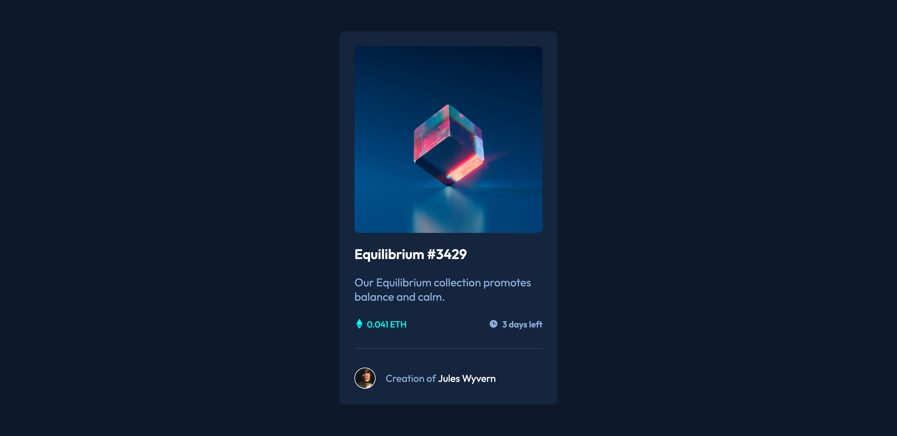

# Frontend Mentor - NFT preview card component solution

This is a solution to the [NFT preview card component challenge on Frontend Mentor](https://www.frontendmentor.io/challenges/nft-preview-card-component-SbdUL_w0U). Frontend Mentor challenges help you improve your coding skills by building realistic projects.

## Table of contents

- [Overview](#overview)
  - [The challenge](#the-challenge)
  - [Screenshot](#screenshot)
  - [Links](#links)
- [My process](#my-process)
  - [Built with](#built-with)
- [Author](#author)

## Overview

### The challenge

Users should be able to:

- View the optimal layout depending on their device's screen size
- See hover states for interactive elements

### Screenshot

The screenshot of project.

**Note: Delete this note and the paragraphs above when you add your screenshot. If you prefer not to add a screenshot, feel free to remove this entire section.**

### Links

- Solution URL: [Github url](https://github.com/florent-augier/nft-preview-card)
- Live Site URL: [You can go here](https://nft-card-challenge-flowww.netlify.app)

## My process

I just begin this project with HTML and CSS because the project is too short to use any framework like React or another one.

In first I realize that is a card in center of viewport. So I create background of HTML element.

After the main work begin in creating card. The card contains 3 sections.

- On top, the card image
- The main section of card (where are the main informations)
- the footer that describes the author

### Built with

- Semantic HTML5 markup
- CSS custom properties
- Flexbox
- CSS Grid

## Author

- Website - [Florent Augier](https://www.flowww-dev.com?target=_blank)
- Frontend Mentor - [@florent-augier](https://www.frontendmentor.io/profile/florent-augier?target="_blank")
